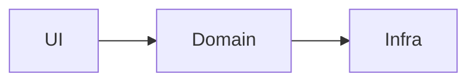

# Architecture

<One paragraph: the system in a sentence.>

## Modules and boundaries

| Module | Owns | Depends on |
|---|---|---|
| | | |

## Flows

```mermaid
sequenceDiagram
  participant UI
  participant Action
  participant DB
  UI->>Action: <input>
  Action->>DB: <write>
  DB-->>Action: <result>
```

### <flow name>

## Conventions

- <naming, layering, where logic lives — the rules a new contributor follows>

## Invariants

- <what must always hold>
